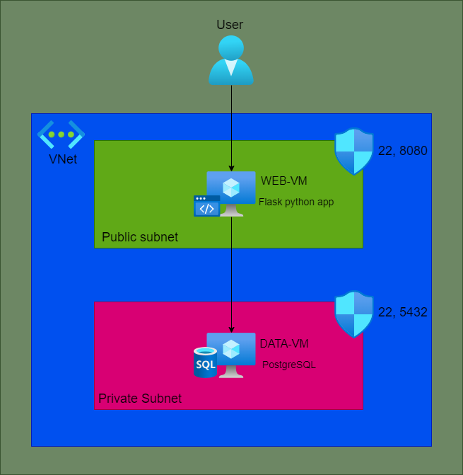

# Terraform-Azure project - Roman Fesunenko

Project of Azure infrastracture that runs application which takes data from the server with Terraform deploying.

### Project architecture:



### Whats project contains?

* Virtual network have public subnet and private subnet.
* Application VM that runs Python flask application that located in public subnet and everyone can to connect.
* Database VM that runs PostgreSQL database that located in private subnet and no one else can to connect except who connect from internal network.

### How to install Terraform project?

* Open the terminal (Powershell/CMD/bash) - You can use VSCode and then go to terminal.
* Choose the path where you want to clone repository from GIT. For example:
  `cd c:\example_path\`
* Clone repository from a git: `git clone https://github.com/IrronRoman19/project_azure_terraform`
* After that you cloned repository from GIT, in repository folder create `terraform.tfvars` that will contain local variables.
* Copy the next content to created `terraform.tfvars` file:

###### IMPORTANT: When you copied the this content, you must change username and password and choose your public IP.

```
### IMPORTANT! ###
# Username and Password - Virtual Machines
vm_username = "<CHOOSE YOUR USERNAME>"
vm_password = "<CHOOSE YOUR PASSWORD>"

### IMPORTANT! ###
# Username and Password - PostgreSQL
postgresql_username = "<CHOOSE YOUR USERNAME>"
postgresql_password = "<CHOOSE YOUR PASSWORD>"

### IMPORTANT! ###
# Your public IP
your_public_ip = "<CHOOSE YOUR PUBLIC IP - CHECK YOUR PUBLIC IP>"


# Resource group
rg_name = "rg_terraform_project_roman"
rg_location = "West Europe"

# Virtual network and subnets names
vnet_name = "terraform_project_vnet"
sb_name_1 = "terraf_public_subnet"
sb_name_2 = "terraf_private_subnet"

# Virtual network and subnets prefix
vnet_address_space = "10.0.0.0/16"
sb_1_address_prefix = "10.0.1.0/24"
sb_2_address_prefix = "10.0.2.0/24"

# IP configurations
ipconfig_name_1 = "web_tier_ip_config"
ipconfig_name_2 = "data-tier_ip_config"
ip_address_1 = "10.0.1.5"
ip_address_2 = "10.0.2.5"
pip_vm_1 = "web-tier-vm-pip"

# Network security group configuration
nsg_name_1 = "nsg_for_public_subnet"
nsg_name_2 = "nsg_for_private_subnet"
nsg_rule_name_1 = "allow_ssh_and_http"
nsg_rule_name_2_1 = "allow_postgressql"
nsg_rule_name_2_2 = "allow_ssh"
nsg_priority_1 = "300"
nsg_priority_2 = "600"
nsg_dest_port_range_1 = "22, 8080"
nsg_dest_port_range_2_1 = "5432"
nsg_dest_port_range_2_2 = "22"

# Virtual machines names
vm_name_1 = "web-tier-vm"
vm_name_2 = "data-tier-vm"

# Postgress variables
postgresql_db_name = "database_simple_net"
postgresql_table_name = "simple_table"
postgresql_name_value_1 = "Roman"
postgresql_name_value_2 = "Baruchi"
postgresql_name_value_3 = "Mahsubak"
postgresql_number_value_1 = 25
postgresql_number_value_2 = 87
postgresql_number_value_3 = 53
```

### How to deploy Azure infrastracture with Terraform:

Enter the next commands:

1. `terraform init`
2. `terraform plan`
3. `terraform apply`
